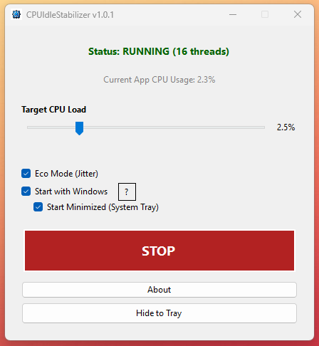

# CPUIdleStabilizer

**Prevents CPU Idle Instability by Maintaining a Low, Steady Load.**

## Overview
Modern CPUs (especially Ryzen 5000/7000/9000 series and ensuring Intel C-State stability) can sometimes become unstable when transitioning to extremely deep low-power idle states (`C6` or lower). This can cause random system freezes, black screens (BSoD), or restarts when the computer is doing absolutely nothing.

**CPUIdleStabilizer** solves this by preventing the CPU from entering these problematic deep sleep states. It runs a very lightweight, controlled workload on *all* cores to keep them just active enough to remain stable, without consuming excess power or generating heat.


## Installation / Builds

There are two ways to download and use the application:

### 1. Standalone Version (Recommended for most users)
*   **File:** `CPUIdleStabilizer.exe` (~80 MB)
*   **Requirements:** None. It runs on any Windows 10/11 machine out of the box.
*   **Details:** Includes the entire .NET runtime embedded within the file.

### 2. Lightweight Version
*   **File:** `CPUIdleStabilizer.exe` (~3 MB)
*   **Requirements:** Requires **[.NET 8 Desktop Runtime](https://dotnet.microsoft.com/en-us/download/dotnet/8.0)** installed.
*   **Details:** Much smaller file size, but you must have the runtime installed separately.

## How It Works (Technical Details)

This application is **NOT** a stress test. It is a precision Load generator.

### The Mechanism
The application creates a dedicated low-priority thread for every logical core in your system. Each thread operates on a precise 1-second (1000ms) cycle using a **Pulse Width Modulation (PWM)** algorithm:

1.  **Work Phase (Duty Cycle):**
    -   For a small fraction of the second (e.g., 5% = 50ms), the thread performs basic arithmetic (`Math.Sqrt`) in a tight loop.
    -   Measurements are taken using high-resolution performance counters (`Stopwatch`) for microsecond accuracy.

2.  **Wait Phase (Sleep):**
    -   For the remainder of the second (e.g., 950ms), the thread strictly sleeps (`Thread.Sleep`), yielding all resources back to the OS.
    -   This allows the CPU to throttle down but prevents it from "parking" or turning off completely logic gates that trigger instability.

### Code Transparency
Here is the core logic running on each thread:

```csharp
while (!_token.IsCancellationRequested)
{
    stopwatch.Restart();

    // Calculate how much to work (e.g., 5% of 1000ms = 50ms)
    // Eco Mode adds random jitter (+/- 2.5%) here
    long busyTicks = CalculateBusyTicksWithJitter(); 

    // 1. WORK: Light arithmetic to keep core active
    while (stopwatch.ElapsedTicks < busyTicks)
    {
        if (_token.IsCancellationRequested) return;
        
        // Simple math operation to generate activity
        // (Compiler prevents optimizing this away)
        for (int i = 0; i < 10; i++) {
             double a = _random.NextDouble();
             _ = Math.Sqrt(a * a + 1.0); 
        }
    }

    // 2. SLEEP: Yield rest of the second to OS
    // We use WaitHandle for efficient, interruptible sleep
    long currentTicks = Stopwatch.GetTimestamp();
    long remainingTicks = cycleEndTicks - currentTicks;
    int remainingMs = (int)(remainingTicks / (Stopwatch.Frequency / 1000.0));

    if (remainingMs > 1)
    {
        _token.WaitHandle.WaitOne(remainingMs);
    }
    else
    {
        Thread.Yield();
    }
}
```

### Stabilization Features
-   **Staggered Start:** The threads do not fire all at once. Their start times are staggered across the 1000ms window. This ensures a consistent, flat power draw rather than "spiky" usage, which is healthier for the VRMs (Voltage Regulator Modules).
-   **Eco Mode (Jitter):** Introduces randomization to the load target (e.g., 5% ± 2.5%). This prevents resonance patterns and fixed-frequency loads that might interfere with other hardware sensors.
-   **System Priority:** All threads run at `Lowest` priority. Any other application (games, browser, etc.) will instantly take precedence. You will **not** lose FPS in games.

## Safety & Impact

### Is this safe?
**Yes, absolutely.**
-   **No Heat:** The load is typically 1-5%. This is comparable to moving your mouse rapidly or watching a YouTube video. It does not generate significant heat.
-   **No Damage:** It performs standard mathematical operations. It does not use "power virus" instruction sets like AVX or Prime95 FFTs.
-   **Battery Life:** On laptops, this *will* prevent deep sleep, so battery usage will be slightly higher (similar to browsing the web). On desktops, the impact is negligible (< 5-10 Watts).

## Usage

1.  **Start:** Click the large **START** button. The status bar will turn Green.
2.  **Settings:**
    -   **Target CPU Load:** Slider from 1% to 10%. (Recommended: **3% - 5%**).
    -   **Eco Mode:** Check to enable load randomization (Recommended: **ON**).
    -   **Start with Windows:** Adds the app to your Startup items.
3.  **Minimize:** Click "Hide to Tray" (or just close the window) to send it to the system tray. It runs silently in the background.

### Command Line Interface (CLI)
For automation or headless servers, you can run the application from the terminal:

```powershell
CPUIdleStabilizer.exe --cli --target 3 --eco on
```

| Argument | Description |
| :--- | :--- |
| `--cli` | Runs in headless mode (no tray icon/window). |
| `--target <1-10>` | Sets the target load percentage (Default is saved setting). |
| `--eco <on\|off>` | Enables or disables jitter randomization. |
| `--autostart <on\|off>` | Registers or unregisters the app from Windows Startup. |
| `--logpath` | Prints the location of the log file. |
| `--help` | Shows the help message. |

## AI Transparency
This project was developed with the assistance of **Google DeepMind's Gemini** models.
- **Code Generation:** Core logic, UI implementation, and build scripts were generated collaboratively with AI.
- **Verification:** The "Code Transparency" section above provides full visibility into the AI-generated logic to ensure safety and correctness.

## Background / Origin Story
This tool was built out of necessity to solve a specific stability issue on high-end hardware.

**The Machine:**
* CPU: AMD Ryzen 7 5800X (8-Core / 16-Thread, Zen 3 — single CCD)
* Motherboard: Gigabyte B550 AORUS PRO
* BIOS: F18 (28 Oct 2025)
* Age: ~4 years

## The Issue

The system (AMD Ryzen 7 5800X on a **Gigabyte B550 AORUS PRO** motherboard) was experiencing **random, complete system freezes when left fully idle for extended periods** (for example, overnight or during long idle periods during the day).

Key characteristics of the issue:

* The system was **100% stable under load** (gaming, stress testing, benchmarking).
* Freezes occurred **only during extended idle**.
* On reboot, Windows Event Viewer consistently logged **Kernel-Power (Event ID 41)** entries, indicating an unclean shutdown following a hard lock.
* There were **no thermal issues**, **no memory errors**, and **no instability under sustained CPU or GPU load**.

At the time of investigation, replacing or migrating the platform was not considered a practical or proportionate solution. Moving from the existing **DDR4-based AM4 platform to a DDR5 platform** would require a full system refresh (motherboard, memory, and potentially CPU), with an estimated upgrade cost in the **AUD $800–$1,200+ range**, depending on component availability and pricing.

Given ongoing **market volatility, supply constraints, and fluctuating hardware prices**, maintaining the current, otherwise stable platform was a deliberate decision. This reinforced the need to identify and resolve the issue through **root-cause analysis and targeted mitigation**, rather than wholesale hardware replacement.

## The Investigation

Testing and log analysis showed this behaviour aligns with a **well-documented Ryzen 5000 idle instability scenario**, particularly on B450/B550/X570 platforms.  Updated all drivers, BIOS, Chipset, Windows, etc.  No change.  Various BIOS settings and configs attempted to resolve the issue.  No change.  

Root cause:

* When the system is fully idle, the CPU aggressively enters **very deep low-power C-States**.
* In some silicon / motherboard / AGESA combinations, this can result in the **core voltage dropping below a stable threshold**.
* When the CPU fails to exit this state correctly, the system stalls at a kernel / interrupt level, resulting in a hard freeze rather than a clean crash.

This explains why:

* The system is stable under load (C-states are avoided).
* The issue only appears during idle.
* The problem reproduces across operating systems (Windows watchdog crash vs. Linux/Unraid hard freeze).

## Attempt 1 – Prime95 (Low-Load Workaround)

**Approach:**
Prime95 was tested as a workaround by attempting to run it in a low-impact configuration to prevent the CPU from entering deep idle states.

**Result:**
Successful, but had a lot of issues in autostarting it with the same settings automatically each boot.  It would load on a full stress test and I have to manually change it.  The thresholds could not be adjusted either.

**Reasons:**

* Prime95 is not designed for sustained low-load operation.
* Even when restricted, it frequently ramped CPU usage above **10%**, triggering:

  * Excessive power draw (60W+)
  * Unnecessary heat

* Configuration was inconsistent and prone to reverting to full torture workloads.

Prime95 proved unsuitable as a long-term idle stabilisation solution.

## Attempt 2 – CPUIdleStabilizer (Custom Tool)

**Approach:**
A purpose-built application (**CPUIdleStabilizer**) was developed to apply a **precisely controlled, minimal CPU workload**.

**Design goal:**

* Keep the CPU just active enough to prevent entry into the problematic deep C-States.
* Avoid unnecessary heat, noise, or power draw.
* Be predictable and stable over long periods.

**Configuration:**

* Sustained CPU load of **~3%**
* Load evenly distributed and intentionally lightweight

**Result:**
✅ **Successful**

**Outcome:**

* System has remained **fully stable for 78 hours of continuous idle operation**.
* No freezes, no watchdog events, no Kernel-Power errors.
* Power draw increased by only **~8W**, keeping temperatures low and fans quiet.
* The CPU remains in a stable power state without sacrificing efficiency.

## Conclusion

The issue was **not** caused by faulty hardware, overheating, or insufficient power delivery.
It was the result of an **idle power-state edge case** involving:

* Ryzen 5000 CPU behaviour
* B550 platform firmware (AGESA / C-state interaction)
* Aggressive low-power voltage scaling at idle

By introducing a **tiny, controlled background workload**, CPUIdleStabilizer effectively prevents the CPU from entering unstable idle states while maintaining excellent thermal and power efficiency.

This solution provided me with a  **practical, low-impact, long-term workaround** for Ryzen idle instability on affected systems, particularly where BIOS-level fixes alone are insufficient or undesirable.


## Developer Info
-   **Framework:** .NET 8 (WinForms)
-   **Architecture:** x64 optimized
-   **License:** MIT
-   **Developer:** cjdatadev

### Screenshot


